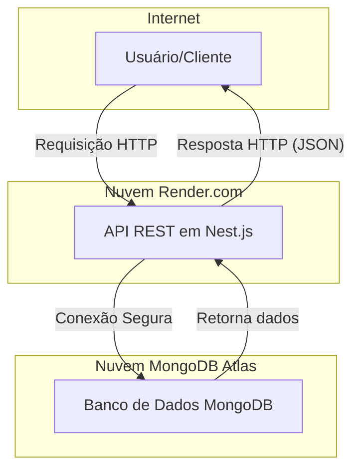

# 🚀 Tech Challenge - Blog API

Este projeto é a implementação de um back-end para uma plataforma de blogging, desenvolvido como parte do Tech Challenge da Pós-Graduação em Full Stack Development da FIAP. O objetivo foi construir uma API RESTful robusta, escalável e de fácil manutenção para gerenciar as postagens de um blog.

## 🛠️ Tecnologias Utilizadas

* **Node.js:** Ambiente de execução para JavaScript no servidor.
* **Nest.JS:** Framework Node.js para construir aplicações eficientes e escaláveis, utilizando TypeScript.
* **TypeScript:** Superset do JavaScript que adiciona tipagem estática ao código.
* **MongoDB:** Banco de Dados NoSQL orientado a documentos, utilizado para persistir os dados das postagens.
* **Mongoose:** ODM (Object-Document Mapper) para modelagem e interação com o MongoDB.
* **Docker & Docker Compose:** Ferramentas para containerização da aplicação e do banco de dados, garantindo consistência entre ambientes.
* **Swagger (OpenAPI):** Geração de documentação interativa e visual da API.
* **Redoc:** Geração de documentação estática e de fácil leitura da API.
* **Jest:** Framework de testes para garantir a qualidade e o funcionamento da lógica de negócio.
* **GitHub Actions:** Ferramenta de CI/CD para automação de testes a cada push no repositório.

## 🧱 Arquitetura do Sistema

Esta seção descreve os componentes principais do sistema, como eles se comunicam e as justificativas por trás das decisões de arquitetura, conforme solicitado para a avaliação do projeto.

### 1️⃣ Principais Componentes

O sistema é composto por três componentes principais que trabalham em conjunto dentro de um ambiente containerizado:

* **API REST:** O coração do sistema, construída com Nest.js. É responsável por receber as requisições dos clientes, aplicar a lógica de negócio e se comunicar com o banco de dados.
* **Banco de Dados:** Um container MongoDB que armazena e gerencia todos os dados da aplicação, como as informações das postagens.
* **Ambiente Docker:** Uma camada de virtualização que encapsula tanto a API quanto o Banco de Dados. Ele garante que o sistema funcione de forma idêntica em qualquer máquina, seja de desenvolvimento ou produção.

### 2️⃣ Diagrama de Fluxo e Comunicação

O diagrama abaixo ilustra a arquitetura de produção, com os serviços hospedados em plataformas de nuvem distintas.



**Descrição do Fluxo:**

1.  O **Usuário** (ou um sistema cliente, como a interface do Swagger ou um futuro front-end) inicia uma ação, que é traduzida em uma **Requisição HTTP** para a API (ex: `POST /posts` para criar uma postagem).
2.  A **API REST**, rodando em um container Docker, recebe a requisição. O Nest.js direciona a requisição para o `Controller` apropriado.
3.  O `Controller` chama o `Service` correspondente, que contém a lógica de negócio.
4.  O `Service` utiliza o **Mongoose** para se comunicar com o **Banco de Dados MongoDB**, solicitando a leitura ou a escrita dos dados necessários.
5.  O Banco de Dados processa a solicitação e retorna os dados para a API.
6.  A API formata esses dados em uma **Resposta HTTP** (geralmente em formato JSON) e a envia de volta para o Usuário.

### 3️⃣ Justificativas das Decisões de Arquitetura

* **Por que Nest.js?** Escolhemos o Nest.js sobre frameworks mais minimalistas como o Express puro por sua arquitetura opinativa baseada em Módulos, Controllers e Services. Isso promove um código altamente organizado, de fácil manutenção e testável, o que é crucial para a escalabilidade do projeto. O uso nativo de TypeScript e o sistema de injeção de dependência também foram fatores decisivos.

* **Por que MongoDB?** Para uma aplicação de blog, a flexibilidade de um banco de dados NoSQL como o MongoDB é ideal. A estrutura de uma postagem pode evoluir (ex: adicionando tags, múltiplos autores), e o schema flexível do MongoDB acomoda essas mudanças sem a necessidade de migrações complexas. Além disso, sua poderosa funcionalidade de busca por texto (`text search`) foi essencial para implementar o endpoint de busca de forma eficiente.

* **Por que Docker?** A containerização foi adotada para resolver o clássico problema do "funciona na minha máquina". Com o Docker, garantimos que o ambiente de desenvolvimento seja idêntico ao de produção e ao de qualquer outro desenvolvedor, eliminando inconsistências. O `docker-compose` simplifica o setup de todo o ambiente (API + Banco de Dados) com um único comando (`docker compose up`), facilitando o início do trabalho no projeto.

* **Por que Swagger & Redoc?** Foram implementadas duas documentações para atender a públicos diferentes. O Swagger UI (`/api`) foi escolhido por sua capacidade de testes interativos, agilizando o desenvolvimento. O Redoc (`/docs`) foi adicionado para fornecer uma documentação estática, com um layout mais limpo e focado na leitura, ideal para consumidores da API.

* **Por que Testes Unitários com Mocking?** A decisão de testar a camada de serviço (`PostsService`) de forma isolada, simulando ("mockando") a resposta do banco de dados, garante que nossos testes sejam rápidos, confiáveis e foquem exclusivamente na lógica de negócio, sem depender de uma conexão real com o banco.

* **Por que GitHub Actions para CI/CD?** A automação foi dividida em duas etapas para cumprir os requisitos de testes e deploy:
    * **CI (Continuous Integration):** A cada `push` ou `pull request`, um workflow é disparado para instalar as dependências e rodar a suíte de testes unitários. Isso garante que novas alterações não quebrem a funcionalidade existente.
    * **CD (Continuous Deployment):** Se os testes passarem em um `push` na branch principal, um segundo job é acionado para construir a imagem Docker final da aplicação e publicá-la no GitHub Container Registry. Isso simula um pipeline de deploy real, deixando uma versão testada e empacotada da aplicação pronta para ser implantada em um ambiente de produção.

## ⚙️ Como Rodar o Projeto (Ambiente de Desenvolvimento Local)

1.  **Pré-requisitos:** É necessário ter o `Docker` e o `Docker Compose` instalados em sua máquina.
2.  **Clone o Repositório:**
    ```bash
    git clone <url-do-seu-repositorio>
    cd <nome-da-pasta-do-projeto>
    ```
3.  **Inicie o Ambiente:** Na raiz do projeto, execute o seguinte comando para construir a imagem e iniciar os containers:
    ```bash
    docker compose up --build
    ```
4.  **Acesso:** A API estará disponível em `http://localhost:3000`.

## 🌐 Acesso ao Projeto em Produção

A aplicação foi implantada na plataforma Render e está disponível publicamente nos seguintes endereços:

* **API Base URL:** `https://techchallengeblog.onrender.com`
* **Documentação Interativa (Swagger):** **[https://techchallengeblog.onrender.com/api](https://techchallengeblog.onrender.com/api)**
* **Documentação Estática (Redoc):** **[https://techchallengeblog.onrender.com/docs](https://techchallengeblog.onrender.com/docs)**

> **Atenção:** A aplicação está hospedada no plano gratuito do Render e hiberna ("dorme") após 15 minutos de inatividade. O **primeiro acesso pode levar de 30 a 60 segundos para "acordar" o serviço**. Após o carregamento inicial, a API funcionará normalmente.

## 📚 Guia da API (Tutorial de Uso)

A API possui duas documentações geradas automaticamente, cada uma com um propósito diferente:

* **Documentação Interativa (Swagger UI):** Ideal para testar os endpoints diretamente pelo navegador.
    * **URL:** **[http://localhost:3000/api](http://localhost:3000/api)**

* **Documentação para Leitura (Redoc):** Apresenta a API em um formato limpo e de fácil leitura, ideal para entender o funcionamento dos recursos.
    * **URL:** **[http://localhost:3000/docs](http://localhost:3000/docs)**

Para referência e entendimento, abaixo está um guia detalhado de cada endpoint disponível.

---

### **1. Criar um Novo Post**
* **Endpoint:** `POST /posts`
* **Descrição:** Cria uma nova postagem no blog.
* **Corpo da Requisição (`Request Body`):** É necessário enviar um objeto JSON com título, conteúdo e autor.
    ```json
    {
      "title": "O que é Nest.js?",
      "content": "Nest.js é um framework Node.js para construir aplicações de back-end eficientes e escaláveis.",
      "author": "João Colombari"
    }
    ```
* **Resposta de Sucesso (`201 Created`):** Retorna o objeto do post recém-criado.

---

### **2. Listar Todos os Posts**
* **Endpoint:** `GET /posts`
* **Descrição:** Retorna uma lista com todas as postagens existentes.
* **Resposta de Sucesso (`200 OK`):** Retorna um array de objetos de post.

---

### **3. Buscar um Post Específico por ID**
* **Endpoint:** `GET /posts/{id}`
* **Descrição:** Retorna uma postagem específica com base no seu `_id`.
* **Parâmetros da URL:**
    * `id` (string): O ID do post a ser buscado.
* **Resposta de Sucesso (`200 OK`):** Retorna o objeto do post encontrado.
* **Resposta de Erro (`404 Not Found`):** É retornada se nenhum post for encontrado com o ID fornecido.

---

### **4. Atualizar um Post**
* **Endpoint:** `PUT /posts/{id}`
* **Descrição:** Atualiza as informações de uma postagem existente.
* **Parâmetros da URL:**
    * `id` (string): O ID do post a ser atualizado.
* **Corpo da Requisição (`Request Body`):** Envie um objeto JSON com os campos que deseja alterar.
    ```json
    {
      "content": "Este é um novo conteúdo atualizado para a postagem."
    }
    ```
* **Resposta de Sucesso (`200 OK`):** Retorna o objeto completo do post **após** a atualização.
* **Resposta de Erro (`404 Not Found`):** É retornada se o post a ser atualizado não for encontrado.

---

### **5. Excluir um Post**
* **Endpoint:** `DELETE /posts/{id}`
* **Descrição:** Remove permanentemente uma postagem do banco de dados.
* **Parâmetros da URL:**
    * `id` (string): O ID do post a ser excluído.
* **Resposta de Sucesso (`200 OK`):** Retorna o objeto do post que acabou de ser removido.
* **Resposta de Erro (`404 Not Found`):** É retornada se o post a ser excluído não for encontrado.

---

### **6. Buscar Posts por Palavra-Chave**
* **Endpoint:** `GET /posts/search`
* **Descrição:** Retorna uma lista de posts cujo título ou conteúdo corresponda ao termo de busca.
* **Parâmetros de Consulta (`Query String`):**
    * `term` (string): A palavra-chave a ser buscada.
    * **Exemplo de uso:** `/posts/search?term=docker`
* **Resposta de Sucesso (`200 OK`):** Retorna um array com os posts encontrados.

## 🎯 Desafios e Aprendizados

Durante o desenvolvimento deste projeto, enfrentamos alguns desafios técnicos que se tornaram grandes oportunidades de aprendizado, como a configuração do ambiente Docker, a simulação de dependências (mocking) para testes unitários e a criação do pipeline de integração contínua com GitHub Actions.