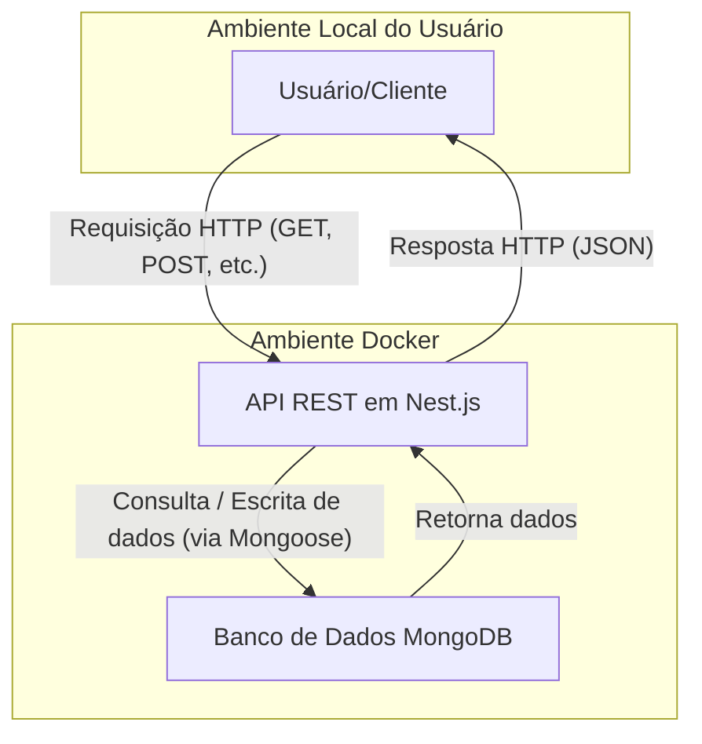

# Tech Challenge - Blog API

Este projeto é a implementação de um back-end para uma plataforma de blogging, desenvolvido como parte do Tech Challenge da Pós-Graduação em Full Stack Development da FIAP. O objetivo foi construir uma API RESTful robusta, escalável e de fácil manutenção para gerenciar as postagens de um blog.

## Tecnologias Utilizadas

* **Node.js:** Ambiente de execução para JavaScript no servidor.
* **Nest.JS:** Framework Node.js para construir aplicações eficientes e escaláveis, utilizando TypeScript.
* **TypeScript:** Superset do JavaScript que adiciona tipagem estática ao código.
* **MongoDB:** Banco de Dados NoSQL orientado a documentos, utilizado para persistir os dados das postagens.
* **Mongoose:** ODM (Object-Document Mapper) para modelagem e interação com o MongoDB.
* **Docker & Docker Compose:** Ferramentas para containerização da aplicação e do banco de dados, garantindo consistência entre ambientes.
* **Swagger (OpenAPI):** Geração de documentação interativa e visual da API.
* **Jest:** Framework de testes para garantir a qualidade e o funcionamento da lógica de negócio.
* **GitHub Actions:** Ferramenta de CI/CD para automação de testes a cada push no repositório.

## Arquitetura do Sistema

Esta seção descreve os componentes principais do sistema, como eles se comunicam e as justificativas por trás das decisões de arquitetura, conforme solicitado para a avaliação do projeto.

### 1. Principais Componentes

O sistema é composto por três componentes principais que trabalham em conjunto dentro de um ambiente containerizado:

* **API REST:** O coração do sistema, construída com Nest.js. É responsável por receber as requisições dos clientes, aplicar a lógica de negócio e se comunicar com o banco de dados.
* **Banco de Dados:** Um container MongoDB que armazena e gerencia todos os dados da aplicação, como as informações das postagens.
* **Ambiente Docker:** Uma camada de virtualização que encapsula tanto a API quanto o Banco de Dados. Ele garante que o sistema funcione de forma idêntica em qualquer máquina, seja de desenvolvimento ou produção.

### 2. Diagrama de Fluxo e Comunicação

O diagrama abaixo ilustra como os componentes se comunicam, desde a requisição do usuário até a resposta final.



**Descrição do Fluxo:**

1.  O **Usuário** (ou um sistema cliente, como a interface do Swagger ou um futuro front-end) inicia uma ação, que é traduzida em uma **Requisição HTTP** para a API (ex: `POST /posts` para criar uma postagem).
2.  A **API REST**, rodando em um container Docker, recebe a requisição. O Nest.js direciona a requisição para o `Controller` apropriado.
3.  O `Controller` chama o `Service` correspondente, que contém a lógica de negócio.
4.  O `Service` utiliza o **Mongoose** para se comunicar com o **Banco de Dados MongoDB**, solicitando a leitura ou a escrita dos dados necessários.
5.  O Banco de Dados processa a solicitação e retorna os dados para a API.
6.  A API formata esses dados em uma **Resposta HTTP** (geralmente em formato JSON) e a envia de volta para o Usuário.

### 3. Justificativas das Decisões de Arquitetura

* **Por que Nest.js?** Escolhemos o Nest.js sobre frameworks mais minimalistas como o Express puro por sua arquitetura opinativa baseada em Módulos, Controllers e Services. Isso promove um código altamente organizado, de fácil manutenção e testável, o que é crucial para a escalabilidade do projeto. O uso nativo de TypeScript e o sistema de injeção de dependência também foram fatores decisivos.

* **Por que MongoDB?** Para uma aplicação de blog, a flexibilidade de um banco de dados NoSQL como o MongoDB é ideal. A estrutura de uma postagem pode evoluir (ex: adicionando tags, múltiplos autores), e o schema flexível do MongoDB acomoda essas mudanças sem a necessidade de migrações complexas. Além disso, sua poderosa funcionalidade de busca por texto (`text search`) foi essencial para implementar o endpoint de busca de forma eficiente.

* **Por que Docker?** A containerização foi adotada para resolver o clássico problema do "funciona na minha máquina". Com o Docker, garantimos que o ambiente de desenvolvimento seja idêntico ao de produção e ao de qualquer outro desenvolvedor, eliminando inconsistências. O `docker-compose` simplifica o setup de todo o ambiente (API + Banco de Dados) com um único comando (`docker compose up`), facilitando o início do trabalho no projeto.

* **Por que Testes Unitários com Mocking?** A decisão de testar a camada de serviço (`PostsService`) de forma isolada, simulando ("mockando") a resposta do banco de dados, garante que nossos testes sejam rápidos, confiáveis e foquem exclusivamente na lógica de negócio, sem depender de uma conexão real com o banco.

* **Por que GitHub Actions para CI?** A automação dos testes com GitHub Actions (CI - Integração Contínua) garante que cada nova alteração no código seja validada automaticamente. Isso previne a introdução de bugs e mantém a estabilidade e a qualidade da base de código ao longo do tempo.

## Como Rodar o Projeto

1.  **Pré-requisitos:** É necessário ter o `Docker` e o `Docker Compose` instalados em sua máquina.
2.  **Clone o Repositório:**
    ```bash
    git clone <url-do-seu-repositorio>
    cd <nome-da-pasta-do-projeto>
    ```
3.  **Inicie o Ambiente:** Na raiz do projeto, execute o seguinte comando para construir a imagem e iniciar os containers:
    ```bash
    docker compose up --build
    ```
4.  **Acesso:** A API estará disponível em `http://localhost:3000`.

## Guia da API

A documentação completa e interativa da API foi gerada com Swagger. É a forma recomendada para testar os endpoints.

* **URL da Documentação Interativa:** **[http://localhost:3000/api](http://localhost:3000/api)**

Nesta interface, é possível ver todos os endpoints, seus parâmetros, schemas de resposta e executar testes diretamente pelo navegador.

*(Uma descrição detalhada de cada endpoint, com exemplos de JSON, pode ser encontrada nas versões anteriores do histórico deste README, se necessário.)*