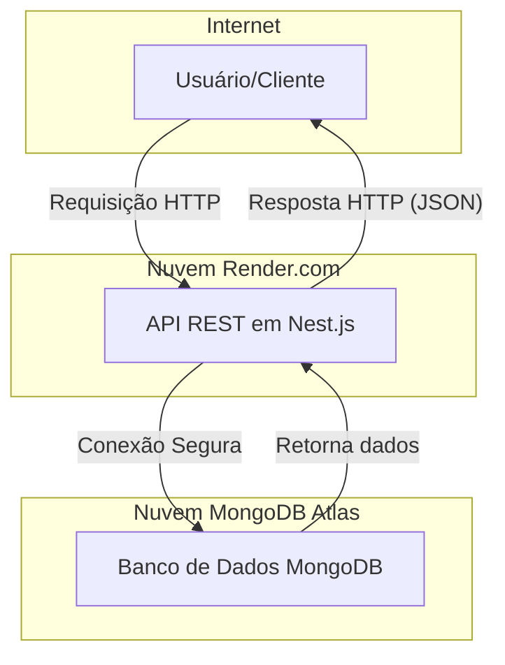

# 🚀 Tech Challenge - Blog API

Este projeto é a implementação de um back-end para uma plataforma de blogging, desenvolvido como parte do Tech Challenge da Pós-Graduação em Full Stack Development da FIAP. O objetivo foi construir uma API RESTful robusta, escalável e de fácil manutenção para gerenciar as postagens de um blog.

## 🛠️ Tecnologias Utilizadas

* **Node.js:** Ambiente de execução para JavaScript no servidor.
* **Nest.JS:** Framework Node.js para construir aplicações eficientes e escaláveis, utilizando TypeScript.
* **TypeScript:** Superset do JavaScript que adiciona tipagem estática ao código.
* **MongoDB:** Banco de Dados NoSQL orientado a documentos.
* **Mongoose:** ODM (Object-Document Mapper) para modelagem e interação com o MongoDB.
* **Docker & Docker Compose:** Ferramentas para containerização da aplicação e do banco de dados.
* **Swagger (OpenAPI) & Redoc:** Geração de documentação interativa e estática da API.
* **Jest:** Framework de testes para garantir a qualidade e o funcionamento da lógica de negócio.
* **GitHub Actions:** Ferramenta de CI/CD para automação de testes e build de imagens Docker.

## 🌐 Acesso ao Projeto em Produção

As aplicações de front-end e back-end foram implantadas na plataforma Render e estão disponíveis publicamente:

* **API Base URL:** **[https://techchallengeblog.onrender.com](https://techchallengeblog.onrender.com)**
* **Documentação Interativa (Swagger):** **[https://techchallengeblog.onrender.com/api](https://techchallengeblog.onrender.com/api)**
* **Front-end (Aplicação):** **[https://techchallenge-frontend-main.onrender.com/](https://techchallenge-frontend-main.onrender.com/)**

> ### ⚠️ Atenção: Como "Acordar" a Aplicação
>
> Ambas as aplicações estão no plano gratuito do Render e hibernam ("dormem") após 15 minutos de inatividade. Para uma melhor experiência no primeiro acesso, siga estes passos:
>
> 1.  **Primeiro, "acorde" o back-end:** Acesse a URL da documentação do Swagger: **[https://techchallengeblog.onrender.com/api](https://techchallengeblog.onrender.com/api)**. Aguarde cerca de 30-60 segundos até a página carregar completamente.
> 2.  **Agora, acesse o front-end:** Abra a URL da aplicação: **[https://techchallenge-frontend-main.onrender.com/](https://techchallenge-frontend-main.onrender.com/)**. Como o back-end já está ativo, a aplicação carregará os posts corretamente.

## ⚙️ Como Rodar o Projeto (Ambiente de Desenvolvimento Local)

1.  **Pré-requisitos:** É necessário ter o `Docker` e o `Docker Compose` instalados em sua máquina.
2.  **Clone o Repositório:**
    ```bash
    git clone [https://github.com/jpcolombari/TechChallengeBlog.git](https://github.com/jpcolombari/TechChallengeBlog.git)
    cd TechChallengeBlog
    ```
3.  **Inicie o Ambiente:** Na raiz do projeto, execute o seguinte comando para construir a imagem e iniciar os containers:
    ```bash
    docker compose up --build
    ```
4.  **Acesso:** A API estará disponível em `http://localhost:3000`.

## 🧱 Arquitetura do Sistema

Esta seção descreve os componentes principais do sistema, como eles se comunicam e as justificativas por trás das decisões de arquitetura, conforme solicitado para a avaliação do projeto.

### 1️⃣ Principais Componentes

O sistema é composto por três componentes principais que trabalham em conjunto dentro de um ambiente containerizado:

* **API REST:** O coração do sistema, construída com Nest.js. É responsável por receber as requisições dos clientes, aplicar a lógica de negócio e se comunicar com o banco de dados.
* **Banco de Dados:** Um container MongoDB que armazena e gerencia todos os dados da aplicação, como as informações das postagens.
* **Ambiente Docker:** Uma camada de virtualização que encapsula tanto a API quanto o Banco de Dados. Ele garante que o sistema funcione de forma idêntica em qualquer máquina, seja de desenvolvimento ou produção.

### 2️⃣ Diagrama de Fluxo e Comunicação

O diagrama abaixo ilustra a arquitetura de produção, com os serviços hospedados em plataformas de nuvem distintas.


```mermaid
graph TD;
    subgraph Internet
        A[Usuário/Cliente]
    end

    subgraph Nuvem Render.com
        B[API REST em Nest.js]
    end

    subgraph Nuvem MongoDB Atlas
        C[Banco de Dados MongoDB]
    end

    A -- Requisição HTTP --> B;
    B -- Conexão Segura --> C;
    C -- Retorna dados --> B;
    B -- Resposta HTTP (JSON) --> A;
```

*(As seções "Descrição do Fluxo" e "Justificativas das Decisões de Arquitetura" podem ser mantidas como estão, pois já estão perfeitas).*

## 📚 Guia da API (Tutorial de Uso)

A API possui duas documentações geradas automaticamente, cada uma com um propósito diferente:

* **Documentação Interativa (Swagger UI):** Ideal para testar os endpoints diretamente pelo navegador.
    * **URL Produção:** **[https://techchallengeblog.onrender.com/api](https://techchallengeblog.onrender.com/api)**
    * **URL Local:** **[http://localhost:3000/api](http://localhost:3000/api)**

* **Documentação para Leitura (Redoc):** Apresenta a API em um formato limpo e de fácil leitura.
    * **URL Produção:** **[https://techchallengeblog.onrender.com/docs](https://techchallengeblog.onrender.com/docs)**
    * **URL Local:** **[http://localhost:3000/docs](http://localhost:3000/docs)**

Abaixo está um guia detalhado de cada endpoint disponível.

---

### **Endpoints de Posts (`/posts`)**

#### **1. Criar um Novo Post**
* **Endpoint:** `POST /posts`
* **Descrição:** Cria uma nova postagem no blog. Requer autenticação.
* **Corpo da Requisição:** JSON com `title`, `content`, `author`.

#### **2. Listar Todos os Posts**
* **Endpoint:** `GET /posts`
* **Descrição:** Retorna uma lista com todas as postagens existentes.

#### **3. Buscar um Post Específico por ID**
* **Endpoint:** `GET /posts/{id}`
* **Descrição:** Retorna uma postagem específica com base no seu `_id`.

#### **4. Atualizar um Post**
* **Endpoint:** `PUT /posts/{id}`
* **Descrição:** Atualiza as informações de uma postagem. Requer autenticação.

#### **5. Excluir um Post**
* **Endpoint:** `DELETE /posts/{id}`
* **Descrição:** Remove uma postagem. Requer autenticação.

#### **6. Buscar Posts por Palavra-Chave**
* **Endpoint:** `GET /posts/search?term={palavra-chave}`
* **Descrição:** Retorna posts cujo título ou conteúdo corresponda ao termo de busca.

---

### **Endpoints de Usuários (`/users`)**

#### **1. Criar um Novo Usuário (Registro)**
* **Endpoint:** `POST /users`
* **Descrição:** Registra um novo usuário (professor) no sistema.
* **Corpo da Requisição:** JSON com `email` e `password`.
    ```json
    {
      "email": "professor@exemplo.com",
      "password": "senhaForte123"
    }
    ```
* **Resposta de Sucesso (`201 Created`):** Retorna o objeto do usuário criado (sem a senha).

---

### **Endpoints de Autenticação (`/auth`)**

#### **1. Realizar Login**
* **Endpoint:** `POST /auth/login`
* **Descrição:** Autentica um usuário e retorna um token JWT.
* **Corpo da Requisição:** JSON com `email` e `password`.
    ```json
    {
      "email": "professor@exemplo.com",
      "password": "senhaForte123"
    }
    ```
* **Resposta de Sucesso (`200 OK`):** Retorna um `access_token`.
    ```json
    {
      "access_token": "eyJhbGciOiJIUzI1NiIsInR5cCI6IkpXVCJ9..."
    }
    ```

## 🎯 Desafios e Aprendizados

Durante o desenvolvimento deste projeto, enfrentamos alguns desafios técnicos que se tornaram grandes oportunidades de aprendizado, como a configuração do ambiente Docker, a simulação de dependências (mocking) para testes unitários e a criação do pipeline de integração contínua com GitHub Actions.